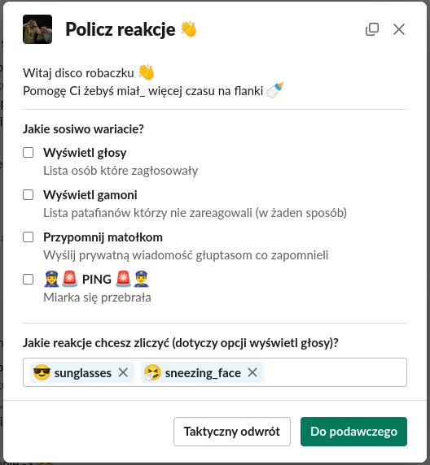
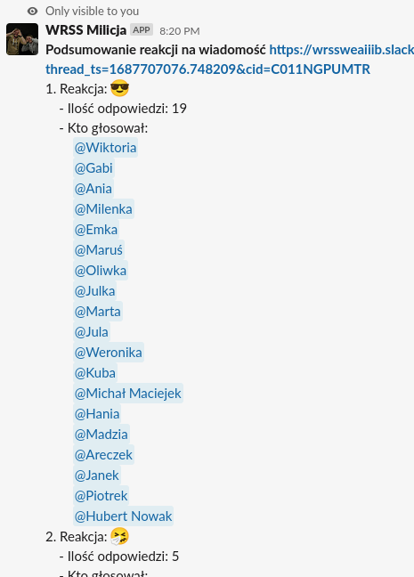

# 📈 Slack Bot WRSS - Reakcje + ping

Bot na komunikator Slack służący do analizowania reakcji do danej wiadomości, czyli WRSS'owego "głosowania", sprawdzania przeczytania wiadomości itp.

## 📚 Funkcjonalności

-   Analiza reakcji do wiadomości
-   Wyświetlanie statystyk
-   Wyświetlanie listy osób, które zagłosowały, które nie zagłosowały
-   Wysyłanie wiadomości do osób, które nie zagłosowały
-   Dodawanie wiadomości na kanale

## 📑 Technologie

Bot napisany jest w Python z wykorzystaniem Slack Bolt API, dobrze udukomentowanego przez twórców komunikatora.

## 📷 Zrzuty ekranu

 

# Instrukcje dla WRSS

## Jak dołączyć bota do kanału

1. W górnym pasku wchodzimy w szczegóły kanału (klikamy na nazwę)
2. Wchodzimy w zakładkę **Integrations**
3. Klikamy **Add an app**
4. W okienku znaleźć **WRSS Ping**

Można korzystać z bota na tym kanale

## Jak uruchomić bota

1. Zainstalować Pythona [tutaj](https://www.python.org/downloads/)
2. Do uruchomienia programu potrzebne są biblioteki, które instaluje się w poniższy sposób\*:
    - `pip install python-dotenv` - służy do korzystania z lokalnych zmiennych środowiskowych
    - `pip install slack_bolt` - API Slack'owe
3. Pobrać to repozytorium.
4. Plik [user_strings.json](./assets/strings/user_strings.json) należy pobrać z [Google Drive](https://drive.google.com/file/d/10sCH1o3yOFmY9WHaP5jsAqAMbCgYATo8/view?usp=sharing) i go wstawić zamiast aktualnego.
5. Należy uruchomić program: `python bot.py`

    > \*komendy mogą przybierać formę `pip3` i `python3` w zależności od OS i wersji Python

## Jak korzystać z bota?

Wchodzimy w ... (opcje) wybranej wiadomości, powinien być widoczny program **Analizuj reakcje**.  
 Gdy go nie widać klikamy **More message shortcuts...** i tam z pewnością będzie ;)

### Miłego korzystania, w razie problemów piszcie/zgłaszajcie bugi :D
